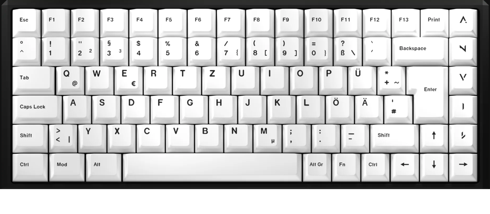

# Teleport Native ISO Keyboard Configurator

A comprehensive web-based keyboard configurator for the Teleport Native ISO 75% mechanical keyboard. This platform allows users to customize RGB lighting, remap keys, create presets, and share configurations with the community.



## 🚀 Features

### 🎨 RGB Lighting Control
- **Per-Key RGB Configuration**: Customize each of the 85 keys individually with HSV color control
- **Live Preview**: Real-time visualization of your color schemes
- **WebUSB Integration**: Direct USB communication with your keyboard (no drivers needed)
- **EEPROM Persistence**: Colors are automatically saved to the keyboard's EEPROM and survive restarts
- **Bulk Operations**: Select multiple keys with Shift/Ctrl and apply colors to all at once

### ⌨️ Keymap Customization
- **Dynamic Key Remapping**: Change any key to any QMK keycode
- **Visual Layout**: Interactive keyboard layout for easy key selection
- **VIA Compatible**: Uses VIA's dynamic keymap system for reliable storage
- **Real-time Sync**: Changes are immediately written to the keyboard

### 🎭 RGB Effect System
- **Multiple Effect Modes**:
  - Static: Solid colors
  - Breathing: Smooth pulsing effect
  - Rainbow: Animated rainbow wave
  - Custom effects via QMK firmware
- **Effect Parameters**:
  - Speed control
  - Hue adjustment
  - Saturation control
  - Brightness/Value control

### 💾 Preset Management
- **Save & Load**: Store your configurations as named presets
- **Cloud Storage**: Presets are saved to Supabase database
- **Share with Community**: Publish presets to the public gallery
- **Import/Export**: Download presets as JSON files
- **Thumbnail Generation**: Automatic visual previews via edge functions

### 👥 Community Features
- **Public Gallery**: Browse and download presets from other users
- **Rating System**: Upvote/downvote presets
- **Comments**: Discuss presets with the community
- **User Profiles**: Follow creators and view their presets
- **Favorites**: Save your favorite presets for quick access

### 🔧 DFU Flashing
- **Web-based Firmware Flashing**: Update your keyboard firmware directly from the browser
- **DFU Protocol Support**: Full implementation of DFU and DfuSe protocols
- **Progress Tracking**: Real-time upload progress and verification
- **No External Tools**: No need for dfu-util or QMK Toolbox

## 📋 Table of Contents

- [Architecture](#-architecture)
- [Project Structure](#-project-structure)
- [Getting Started](#-getting-started)
- [QMK Firmware](#-qmk-firmware)
- [WebUSB Communication Protocol](#-webusb-communication-protocol)
- [Database Schema](#-database-schema)
- [Components](#-components)
- [Pages](#-pages)
- [Development](#-development)
- [Deployment](#-deployment)

## 🏗 Architecture

```
┌─────────────────┐
│   React App     │
│   (Frontend)    │
└────────┬────────┘
         │
         ├─────────────────┐
         │                 │
    ┌────▼─────┐     ┌────▼─────┐
    │ WebUSB   │     │ Supabase │
    │          │     │          │
    └────┬─────┘     └────┬─────┘
         │                │
    ┌────▼─────────┐      │
    │   Keyboard   │      │
    │   (QMK)      │      │
    └──────────────┘      │
                    ┌─────▼──────┐
                    │ PostgreSQL │
                    │ (Database) │
                    └────────────┘
```

### Technology Stack

**Frontend:**
- React 18 with TypeScript
- Vite (build tool)
- React Router (navigation)
- Tailwind CSS (styling)
- Lucide React (icons)

**Backend:**
- Supabase (BaaS)
  - PostgreSQL database
  - Authentication
  - Row Level Security
  - Edge Functions
  - Storage

**Firmware:**
- QMK Firmware
- VIA support
- RAW HID protocol
- RGB Matrix
- Dynamic keymap

## 📁 Project Structure

```
project/
├── src/
│   ├── components/          # Reusable React components
│   │   ├── EffectControls.tsx      # RGB effect configuration UI
│   │   ├── KeyboardLayout.tsx      # Visual keyboard representation
│   │   ├── KeycodeSelector.tsx     # QMK keycode picker
│   │   ├── KeymapControls.tsx      # Keymap mode controls
│   │   ├── Navbar.tsx              # Top navigation bar
│   │   ├── ProtectedRoute.tsx      # Auth-protected route wrapper
│   │   └── RGBControls.tsx         # RGB color picker and controls
│   │
│   ├── contexts/            # React context providers
│   │   └── AuthContext.tsx         # Authentication state management
│   │
│   ├── data/               # Static data and constants
│   │   ├── keyboardLayout.ts       # Keyboard layout definition (85 keys)
│   │   └── qmkKeycodes.ts          # Complete QMK keycode library
│   │
│   ├── lib/                # External integrations
│   │   ├── dfu.ts                  # DFU protocol implementation
│   │   ├── dfuse.ts                # DfuSe extensions
│   │   └── supabase.ts             # Supabase client & types
│   │
│   ├── pages/              # Main application pages
│   │   ├── Configurator.tsx        # Main configuration interface
│   │   ├── DFUFlash.tsx            # Firmware flashing tool
│   │   ├── Gallery.tsx             # Public preset gallery
│   │   ├── Login.tsx               # User login
│   │   ├── Register.tsx            # User registration
│   │   ├── MyPresets.tsx           # User's saved presets
│   │   ├── PresetDetail.tsx        # Individual preset view
│   │   └── Profile.tsx             # User profile management
│   │
│   ├── types/              # TypeScript type definitions
│   │   └── effects.ts              # RGB effect types
│   │
│   ├── utils/              # Utility functions
│   │   ├── colorUtils.ts           # HSV/RGB conversion
│   │   └── keycodeConverter.ts     # Keycode string ↔ hex conversion
│   │
│   ├── App.tsx             # Root component with routing
│   ├── main.tsx            # Application entry point
│   └── index.css           # Global styles
│
├── supabase/
│   ├── functions/          # Edge Functions
│   │   └── generate-preset-thumbnails/
│   │       └── index.ts            # Preset thumbnail generator
│   │
│   └── migrations/         # Database migrations
│       ├── 20251031101419_initial_schema.sql
│       ├── 20251031102347_fix_security_and_performance_issues.sql
│       ├── 20251031102724_fix_preset_scores_security_definer.sql
│       ├── 20251031111504_remove_unused_indexes.sql
│       ├── 20251031192551_add_delete_user_account_function.sql
│       └── 20251102222359_add_effects_to_presets.sql
│
├── public/                 # Static assets
│   ├── keyboard-base.png          # Keyboard layout image
│   └── image.png
│
├── teleport_native_iso_keymap.c   # QMK firmware keymap
├── rules.mk                       # QMK build configuration
├── EEPROM_SETUP.md               # EEPROM persistence documentation
├── package.json                  # NPM dependencies
├── vite.config.ts               # Vite configuration
├── tailwind.config.js           # Tailwind CSS configuration
├── tsconfig.json                # TypeScript configuration
└── README.md                    # This file
```

## 🚦 Getting Started

### Prerequisites

- Node.js 18+ and npm
- Modern web browser with WebUSB support (Chrome, Edge, Opera)
- Teleport Native ISO keyboard with custom QMK firmware

### Installation

1. **Clone the repository**
```bash
git clone <repository-url>
cd project
```

2. **Install dependencies**
```bash
npm install
```

3. **Configure environment variables**

Create a `.env` file in the root directory:
```env
VITE_SUPABASE_URL=your_supabase_project_url
VITE_SUPABASE_ANON_KEY=your_supabase_anon_key
```

4. **Start development server**
```bash
npm run dev
```

5. **Build for production**
```bash
npm run build
```

### Connecting Your Keyboard

1. Flash the custom QMK firmware to your keyboard (see [QMK Firmware](#-qmk-firmware))
2. Open the configurator in a WebUSB-compatible browser
3. Navigate to the Configurator page
4. Click "Connect Keyboard"
5. Select your keyboard from the device picker

## 🎹 QMK Firmware

### Overview

The QMK firmware (`teleport_native_iso_keymap.c`) implements:

- **RAW HID Protocol**: Custom communication protocol for WebUSB
- **RGB Matrix Control**: Per-key RGB LED management
- **Dynamic Keymap**: VIA-compatible key remapping
- **EEPROM Persistence**: Automatic saving of RGB and keymap settings

### Building the Firmware

1. **Install QMK CLI**
```bash
python3 -m pip install qmk
qmk setup
```

2. **Copy firmware files to QMK directory**
```bash
# Copy keymap.c to your QMK keyboard directory
cp teleport_native_iso_keymap.c ~/qmk_firmware/keyboards/teleport/native/iso/keymaps/default/keymap.c

# Copy rules.mk
cp rules.mk ~/qmk_firmware/keyboards/teleport/native/iso/keymaps/default/rules.mk
```

3. **Compile firmware**
```bash
cd ~/qmk_firmware
qmk compile -kb teleport/native/iso -km default
```

4. **Flash firmware**
```bash
# Put keyboard in bootloader mode (ESC + plug in)
qmk flash -kb teleport/native/iso -km default
```

### Firmware Features

#### rules.mk Configuration
```makefile
RGB_MATRIX_ENABLE = yes    # Enable RGB Matrix support
RAW_ENABLE = yes          # Enable RAW HID for WebUSB
VIA_ENABLE = yes          # Enable VIA compatibility
```

#### Key Components

**1. LED Color Map (ledmap)**
- 85 keys × 3 bytes (HSV format)
- Default rainbow gradient configuration
- Stored in EEPROM at address 32-287

**2. Dynamic Keymap**
- VIA-compatible dynamic key remapping
- Uses matrix position mapping
- Supports all QMK keycodes

**3. Matrix Mapping Table**
```c
const uint8_t KEY_TO_MATRIX[85][2] = {
    // Maps linear key index (0-84) to [row, col]
    {0, 0}, {1, 0}, {0, 1}, {1, 1}, ...
};
```

**4. EEPROM Functions**
- `save_ledmap_to_eeprom()`: Saves RGB colors
- `load_ledmap_from_eeprom()`: Loads RGB colors
- `keyboard_post_init_user()`: Auto-loads on boot

## 🔌 WebUSB Communication Protocol

### Protocol Overview

The keyboard uses RAW HID (32-byte packets) for communication:

```
Packet Structure:
[Command Byte] [Data Bytes...] [Padding to 32 bytes]
```

### Commands Reference

#### RGB Commands

**0x20: Set Single Key Color**
```
Request:  [0x20] [key_index] [H] [S] [V] [0...0]
Response: [0x20] [0x01]                           // Success
```

**0x21: Bulk Set Colors**
```
Request:  [0x21] [count] [idx1] [H1] [S1] [V1] [idx2] [H2]...
Response: [0x21] [0x01]
```

**0x22: Get Key Color**
```
Request:  [0x22] [key_index] [0...0]
Response: [0x22] [key_index] [H] [S] [V] [0...0]
```

**0x30: Set RGB Effect**
```
Request:  [0x30] [effect_mode] [speed] [hue] [sat] [val]
Response: [0x30] [0x01]
```

**0x31: Get RGB Effect**
```
Request:  [0x31] [0...0]
Response: [0x31] [effect_mode] [speed] [hue] [sat] [val]
```

#### Keymap Commands

**0x05: Set Keycode**
```
Request:  [0x05] [layer] [key_index] [keycode_hi] [keycode_lo]
Response: [0x05] [0x01]
```

**0x06: Get Keycode**
```
Request:  [0x06] [layer] [key_index] [0...0]
Response: [0x06] [layer] [key_index] [keycode_hi] [keycode_lo]
```

#### Persistence Commands

**0x70: Save to EEPROM**
```
Request:  [0x70] [0...0]
Response: [0x70] [0x01]
```

**0x71: Load from EEPROM**
```
Request:  [0x71] [0...0]
Response: [0x71] [0x01]
```

### Color Format

Colors use HSV (Hue, Saturation, Value) format:
- **Hue**: 0-255 (color wheel: 0=red, 85=green, 170=blue)
- **Saturation**: 0-255 (0=white, 255=fully saturated)
- **Value**: 0-255 (brightness: 0=off, 255=max)

## 🗄 Database Schema

### Tables

#### profiles
User profile information
```sql
- id: uuid (PK, references auth.users)
- username: text (unique, required)
- avatar_url: text (nullable)
- bio: text (nullable)
- created_at: timestamptz
- updated_at: timestamptz
```

#### keyboard_models
Supported keyboard models
```sql
- id: uuid (PK)
- name: text (required)
- layout_type: text (e.g., "75_iso")
- key_count: integer (85 for this keyboard)
- description: text (nullable)
- created_at: timestamptz
```

#### presets
User-created configurations
```sql
- id: uuid (PK)
- name: text (required)
- description: text (nullable)
- creator_id: uuid (FK → profiles)
- keyboard_model_id: uuid (FK → keyboard_models)
- thumbnail_url: text (nullable)
- rgb_config: jsonb (colors array)
- keymap_config: jsonb (keymap array, nullable)
- macro_config: jsonb (nullable)
- effect: jsonb (effect configuration, nullable)
- visibility: text (public/unlisted/private)
- download_count: integer
- created_at: timestamptz
- updated_at: timestamptz
```

#### ratings
Preset voting system
```sql
- id: uuid (PK)
- user_id: uuid (FK → profiles)
- preset_id: uuid (FK → presets)
- vote: smallint (1 or -1)
- created_at: timestamptz
- updated_at: timestamptz
- UNIQUE(user_id, preset_id)
```

#### comments
Preset discussion
```sql
- id: uuid (PK)
- user_id: uuid (FK → profiles)
- preset_id: uuid (FK → presets)
- parent_id: uuid (nullable, for replies)
- content: text (required)
- created_at: timestamptz
- updated_at: timestamptz
```

#### favorites
User's favorite presets
```sql
- id: uuid (PK)
- user_id: uuid (FK → profiles)
- preset_id: uuid (FK → presets)
- created_at: timestamptz
```

#### follows
User following system
```sql
- id: uuid (PK)
- follower_id: uuid (FK → profiles)
- following_id: uuid (FK → profiles)
- created_at: timestamptz
```

### Views

#### preset_scores
Aggregated voting scores
```sql
- preset_id: uuid
- score: integer (upvotes - downvotes)
- upvotes: integer
- downvotes: integer
```

### Row Level Security (RLS)

All tables have RLS enabled with policies:
- Users can read public data
- Users can only modify their own data
- Preset visibility controls who can see them
- Secure by default

## 🧩 Components

### KeyboardLayout.tsx
Visual representation of the keyboard
- Renders 85 keys in 75% ISO layout
- Handles key selection (single, shift+click, ctrl+click)
- Displays current colors and keycodes
- Shows selection indicators

**Props:**
```typescript
{
  keyColors: number[][];           // HSV colors for each key
  selectedKeys: Set<number>;       // Currently selected keys
  onKeyClick: (index, shift, ctrl) => void;
  keymapMode?: boolean;           // Show keycodes instead of labels
  keymap?: string[];              // Current keymap
  selectedKeyForKeymap?: number;  // Key being remapped
}
```

### RGBControls.tsx
RGB color picker and bulk operations
- HSV color sliders
- Apply to selected keys
- Apply to all keys
- Preset color palette
- Export/Import JSON

### EffectControls.tsx
RGB effect configuration
- Effect mode selector (Static, Breathing, Rainbow, etc.)
- Speed control
- Hue adjustment
- Saturation control
- Brightness control
- Sync to keyboard button

### KeymapControls.tsx
Keymap mode toggle and controls
- Enable/disable keymap mode
- Instructions for users
- Sync keymap to keyboard

### KeycodeSelector.tsx
QMK keycode picker
- Categorized keycode list
- Search functionality
- Visual keycode preview
- Apply button

### Navbar.tsx
Navigation and user menu
- Logo and branding
- Page navigation
- User authentication status
- Profile dropdown
- Logout functionality

### ProtectedRoute.tsx
Authentication wrapper
- Redirects to login if not authenticated
- Shows loading state
- Passes children to authenticated users

## 📄 Pages

### Configurator.tsx
Main configuration interface
- WebUSB connection management
- RGB color customization
- Effect configuration
- Keymap editing
- Preset save/load
- Real-time sync with keyboard

**State Management:**
- `keyColors`: HSV colors for all keys
- `selectedKeys`: Currently selected key indices
- `device`: WebUSB device handle
- `connected`: Connection status
- `effectConfig`: RGB effect settings
- `keymapMode`: Keymap editing mode toggle
- `keymap`: Current key assignments

### Gallery.tsx
Public preset browser
- Grid view of all public presets
- Search by name/creator
- Filter by rating
- Sort options (popular, recent, top-rated)
- Load preset to configurator
- Preview thumbnails
- Creator information

### MyPresets.tsx
User's saved presets
- List of user's presets
- Edit/delete controls
- Visibility settings
- Create new preset
- Load to configurator

### PresetDetail.tsx
Individual preset view
- Full preset information
- RGB preview
- Keymap preview (if available)
- Download/load buttons
- Rating (upvote/downvote)
- Comments section
- Creator profile link
- Favorite toggle

### Profile.tsx
User profile management
- Username update
- Bio editing
- Avatar upload (future feature)
- Statistics (presets created, followers)
- Account deletion
- User's public presets

### Login.tsx & Register.tsx
Authentication pages
- Email/password authentication
- Form validation
- Error handling
- Redirect to previous page after login

### DFUFlash.tsx
Firmware flashing tool
- WebUSB DFU mode detection
- Firmware file upload (.bin)
- Erase/program/verify operations
- Progress tracking
- Device information display

## 🛠 Development

### Available Scripts

```bash
# Start development server
npm run dev

# Build for production
npm run build

# Preview production build
npm run preview

# Run ESLint
npm run lint

# Type check
npm run typecheck
```

### Code Style

- TypeScript strict mode enabled
- ESLint with React + TypeScript rules
- Functional components with hooks
- Tailwind CSS for styling
- Async/await for async operations

### Adding New Features

1. **New Component**: Add to `src/components/`
2. **New Page**: Add to `src/pages/` and update routes in `App.tsx`
3. **New Utility**: Add to `src/utils/`
4. **Database Changes**: Create new migration in `supabase/migrations/`
5. **New Types**: Add to `src/types/` or relevant file

### Testing Locally

1. Connect your keyboard
2. Open browser DevTools
3. Check Console for WebUSB messages
4. Monitor Network tab for Supabase calls
5. Test all features in sequence

## 🚀 Deployment

### Frontend (Vite App)

Deploy to any static hosting:

**Vercel:**
```bash
npm run build
vercel --prod
```

**Netlify:**
```bash
npm run build
netlify deploy --prod --dir=dist
```

**Environment Variables Required:**
- `VITE_SUPABASE_URL`
- `VITE_SUPABASE_ANON_KEY`

### Backend (Supabase)

1. **Create Supabase Project**
   - Go to https://supabase.com
   - Create new project
   - Copy URL and anon key

2. **Run Migrations**
   ```bash
   # Install Supabase CLI
   npm install -g supabase

   # Link to your project
   supabase link --project-ref your-project-ref

   # Push migrations
   supabase db push
   ```

3. **Deploy Edge Functions**
   ```bash
   supabase functions deploy generate-preset-thumbnails
   ```

4. **Configure Storage**
   - Enable public bucket for preset thumbnails
   - Set up RLS policies for storage

### Firmware Distribution

1. Compile QMK firmware
2. Host .bin file on CDN or GitHub releases
3. Users can flash via DFU Flash page

## 📝 License

This project is licensed under the MIT License - see the [LICENSE](LICENSE) file for details.

### Third-Party Licenses

This project includes code from:
- **WebDFU** by Devan Lai - ISC License (https://github.com/devanlai/webdfu)

## 🤝 Contributing

[Add contribution guidelines]

## 📧 Support

[Add support contact information]

## 🙏 Acknowledgments

- QMK Firmware project
- VIA keyboard configurator
- Supabase team
- React and Vite communities

---

Built with ❤️ for the mechanical keyboard community
